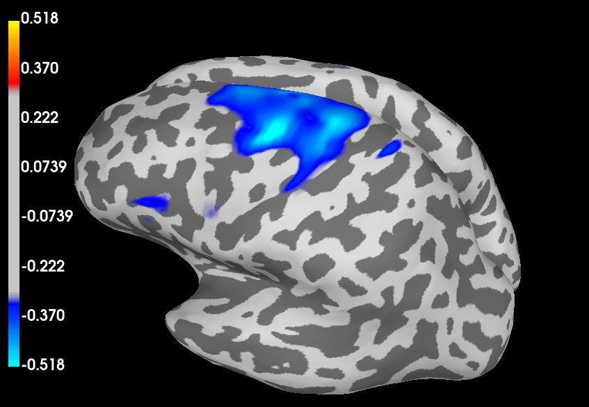

# Source Reconstruction of Induced MEG Responses using an LCMV Beamformer
This pipeline is used to analyse CTF MEG data taken in Nottingham (SPMIC) using MNE-python. Pre-processing, forward modelling, and source reconstruction are separated into three scripts. The below describes each script in a lot of detail to allow for easy usage and adaptation by non-experienced programmers/scientists.

**Important Notes:**

These scripts must be ran section-wise, as some stages require manual input from the user. For a more automated approach, see the equivalent scripts in *mTBI_predict_notts*.

Most MNE methods act in-place, e.g., running `data.do_operation()` will usually perform `do_operation` on `data`, without having to assign to a new variable. If you want to perform a method on an object without changing it, you would instead run `data.copy().do_operation()`, which applies `do_operation` to a copy of `data`, not `data` itself. 

## MNE and FreeSurfer Installation
It is recommended to install MNE via the standalone installers, using the following link: https://mne.tools/stable/install/installers.html#installers.

The standalone installers provide you with a readymade environment, including spyder and jupyter notebooks. This environment also includes most of the signal processing tools that you will ever need to analyse EEG, MEG or fMRI data.

FreeSurfer is more tricky if using windows, as it only runs on linux systems. If using a windows machine, follow the instructions on this page, https://surfer.nmr.mgh.harvard.edu/fswiki/FS7_wsl_ubuntu, to install FreeSurfer via WSL. 

Note that you also will need to install MNE on WSL to run the necessary commands. This can be done using conda or pip, following these instructions: https://mne.tools/stable/install/manual_install.html#manual-install.

Once installed, you will need to follow the instructions at https://mne.tools/stable/auto_tutorials/forward/10_background_freesurfer.html to perform the necessary FreeSurfer and MNE commands.

**These steps can be tricky if new to computing. Often the best way to get this done is to directly consult somebody who has done it before.**

## Pre-Processing
The goals of pre-processing MEG data (in this case) are as follows:
1) Remove high and low frequency noise using synthetic third-order gradiometry and bandpass filtering
2) Annotate periods of data that are corrupted by noise, caused by SQUID sensor "resets" or muscle artefacts
3) Perform ICA on the data to remove blink and cardiac artefacts

As opposed to other pre-processing procedures, this one is designed to be as general as possible, i.e., avoiding narrowband filtering and epoching, to allow for a lot of flexibility in later analysis steps.

#### Setting up Paths and Loading Data
The `root` path is the path that contains all of the data, both raw and processed, i.e., the *base* of the folder structure.

The `data_path` is the path within the `root` folder that contains the *raw* data, i.e., data **that has not been processed in any way**.

The `deriv_path` contains the *derivatives* of the raw data, i.e., data that **has been processed in some way**.

The raw data is loaded (a .ds file in this case, straight from a CTF MEG system) using `read_raw_ctf` and given the name `raw`, which is the standard name of all continuous (not segmented into trials/epochs) data objects in MNE. Note that we set `preload=True`, which loads the data into memory straight away - this is advisable as it prevents some easy mistakes later.

The script then prints out the `info` object to the console (`raw.info`). All data objects in MNE have an `info` attribute, which contains the meta-data related to the file. Understanding the `info` object is crucial as most methods in MNE use information contained in this to perform functions. Printing out the `info` object is a good sanity check and is useful in debugging.

#### Basic Pre-Processing
Next, we clean the data up by first applying *third-order gradiometry*, specific to CTF MEG systems, by running `apply_gradient_compensation` with `grade=3` (representing the *order* of the synthetic gradiometry being applied). Synthetic gradiometry increases sensitivity to nearby magnetic fields (i.e., from the brain) and greatly reduces the sensitivity to fields which come from distant sources (i.e., external sources of noise). 

We then filter to a so-called *broadband* by applying the `filter` method to `raw`, setting `l_freq` (highpass) and `h_freq` (lowpass) thresholds. A broadband should include most of the brain activity of interest, excluding high and low frequencies to reduce noise. Most brain signals of interest manifest in the 1-100 Hz range, however, for MEG it is advantageous to filter below 50 Hz to avoid mains-electricity noise, and in most cases this covers most of the activity of interest (evoked responses as well as delta/theta/alpha/beta rhythms). The effect of these basic pre-processing steps is shown below.

#### Selecting Bad Channels
There are several ways of automatically detecting bad channels, e.g. by thresholding a power spectral density (PSD) curve, or using the covariance of the data filtered into a high frequency. However, if done improperly you may accidentally remove good channels. Therefore it is better (at least at first) to identify these by eye. 

At any point during processing, channels can be removed by running `raw.plot()` and simply left clicking the bad channels.

#### Annotating Corrupted Data Segments
The first stage of annotation is head movement. During a MEG recording, we also take data from a set of head-position indicator (HPI) coils. Using these, we can plot the position of the head during the entire scan. HPI positions are taken using `hpi.extract_chpi_locs_ctf` and `hpi.compute_head_pos`. The positions are then converted to *gradients* using `np.gradient`, allowing a threshold to be set which indicates moments of sudden head movement. From the figure below, it is clear which points in time the participant made sudden head movements. **You may need to adjust the threshold depending on how conservative you want to be with movement**.

Once timepoints of high head movement have been identified, this must be converted to an `Annotations` object. To create an `Annotations` object, we need an array of indices which represent the onset times, an array of durations (number of datapoints, base this on the sampling frequency of the HPIs), and an array of descriptors (which can just be a single value/string if all descriptors are the same). These three arrays are then used to initialise the `Annotations` class, **along with the *starting time* of the scan**, found using `raw.info['meas_date']`. 

Next, SQUID resets and muscle artefacts are identified using the `preprocessing.annotate_amplitude` function. This function identifies local peaks in signal amplitude which are distinct from the neighbouring datapoints, i.e., not slow continuous changes. The function requires a `peak` threshold, as well as a `min_duration` which is the minimum duration that the signal must remain above `peak` to be considered an artefact. Optionally, the function takes a `bad_percent` parameter which is the percentage of time a channel must remain above the artefact threshold to be considered a bad channel. SQUID resets are identified using a very high threshold (because these events are so big!), while a much smaller threshold is used to detect muscle artefacts.

Annotations objects are made for the SQUID resets and muscle artefacts, in exactly the same way as the head movements. However, I find the SQUID resets should be given a long duration which starts before and finishes after the actual event (by several seconds!) as many of the channels do not return to baseline for a little while. Muscle artefacts can be given shorter durations.

Once all the separate `Annotations` objects have been made, they can be set in the data using `raw.set_annotations` and passing **the sum** of the annotations created by each source of noise.

**It is important that you check that the peak values and durations are configured properly for your dataset.**

#### Power Spectral Density 
The power spectral density (PSD) is plotted at this stage (which automatically ignored the bad annotated segments) as a way to check that quality of the data after basic pre-processing. A good and bad example is shown below. The bottom PSD was created by purposely not annotating the SQUID resets, i.e., if the PSD looks like that, check for bad channels and SQUID resets or movement using `raw.plot()`, and perhaps adjust annotation thresholds/durations.

#### Artefact Removal using ICA
After annotation of gross artefacts, blinking and cardiac artefacts can be removed quite simply using ICA. If performing ICA on continuous data (a `raw` object), it is important that bad segments are properly annotated as these will be ignored by the ICA fitting by setting `reject_by_annotation=True`.

The `ICA` class is initialised, requiring only the number of components (`n_components`). In most cases, 20 or 30 is enough, as blinks and cardiac artefacts create a lot of variance in the data, meaning these are often contained in the top few components. 

Next, we `fit` the ICA object, passing the `raw` object. We set `reject_by_annotation=True` so that the ICA fitting is not dominated by noise sources. We then plot topographical maps (topomaps) of the components, showing the spatial distribution of each, as well as the reconstructed timecourses. 

Bad ICA components are selected by left clicking on the reconstructured component timecourses. Blinking and cardiac components are quite easy to spot - see components 0 and 8 in the figure below.

The next section then applies the ICA to the `raw` object, zeroing out the bad components. Note that if you run the whole script all at once, the ICA will be applied before you select the bad components, hence this script should be run section-wise. For a more automated ICA approach, see the equivalent script in *mTBI_predict_notts*

#### Save out Pre-Processed Data
General pre-processing is now done. Save out the pre-processed file as a `.fif` in the derivatives folder.

## Forward Modelling
The components required for a MEG forward model are:
1) A segmented MRI, produced using FreeSurfer (see FreeSurfer section)
2) A transformation matrix (`trans`) that is used to map the segmented MRI to the space defined by the MEG sensors (often called co-registration)
3) A source-space (`src`), which is a set of coordinates within the segmented MRI that will be used to model magnetic dipoles
4) A conduction model (`bem`), which uses the segmented MRI to estimate field conduction through the head volume. 

A forward solution is then calculated using the above components. The outcome is a set of *lead fields* (`fwd`), which estimate how fields produced by dipoles at each of the source-space coordinates project onto the array of sensors.

The following sections will describe how each of these components are produced using the `2_forward_model.py` script.

Before beginning, note the line in the first section of the script:
`mne.viz.set_3d_options(depth_peeling=False, antialias=False)`
This seems to enable all the 3D plotting within MNE - without this line some of the features don't work properly on some computers.

#### Setting up Paths and Loading Data
Paths and data are loaded the same as in pre-processing. However, we load in the pre-processed data rather than the raw data.

For forward modelling, We are only using this data for the `info` object, containing meta-data stored in the MEG dataset. Specifically, this info object is required because it contains a *montage*, i.e., a set of 3D coordinates corresponding to sensor locations, HPI coil locations, and digitised headshape points (taken using a polhemus or other digitisation methods). If you run `data.info`, you should see a line among the outputs that looks something like *"dig: 485 items (3 Cardinal, 482 Extra)"*, meaning the montage contains a digitisation of three HPI coils (used as fiducial markers) and 482 headshape points.

#### Load FreeSurfer Files
Next we load the outputs from FreeSurfer. These are contained in the `subjects_dir` directory. For more information on this, see https://mne.tools/stable/auto_tutorials/forward/10_background_freesurfer.html.

If you have a FreeSurfer reconstruction for the subject, set `subjects_dir = r"path\to\your\freesurfer\subjects_dir"` and then set `fs_subject` to a string corresponding to the name of the subject folder in `subjects_dir`, e.g. "sub-01". If you do not have a FreeSurfer reconstruction for the subject MRI, set `subjects_dir = op.dirname(mne.datasets.fetch_fsaverage(verbose=True))`, and set `fs_subject = "fsaverage"`, which allows you to use a template freesurfer reconstruction from the MNI-152 brain. However, note that **fsaverage should only be used for testing, not proper study results**.

#### Co-Registration
Next we need to obtain a transformation matrix that maps the segmented MRI, loaded in the last section, to the position of the head in the MEG helmet. Here we take an automated approach, which works pretty well for most cases, but does not allow manual tweaking. 

The coregistration object, `coreg`, is created using `mne.coreg.Coregistration`, taking the `info` object (containing the digitisation), as well as the FreeSurfer folder and subject (containing the segmented MRI). Once this object is created, we can apply a series of methods to perform the coregistration.

Firstly, a crude transformation is performed by simply matching the *fiducial* positions in both the MRI and the digitisation. This is performed by running `coreg.fit_fiducials()`. The fiducial points in the digitisation have a position which is determined by the HPI coils in the MEG, i.e., these remain fixed as this was where the head was positioned during the scan. The fiducial positions on the MRI are automatically estimated using the corresponding positions on fsaverage, and are therefore very approximate, but given that we will refine the transformation later, this is not too important. 

Next, an iterative closest point (ICP) algorithm is applied to match the surface of the MRI to the headshape points in the digitisation. To do this, we run `coreg.fit_icp()` with a single argument which is the number of iterations to perform - technically the more the better, but the algorithm will automatically stop at convergence (20 is usually enough).

Here, we may want to remove outlier points in the digitisation that may have thrown off the ICP. To do this, we run `coreg.omit_head_shape_points()` with a single argument which is the distance threshold for point omission in m, e.g. 5/1000 for 5mm threshold. Following this, further ICP can be performed to refine the coregistration. 

An image of the MRI and MEG sensor array before and after coregistration is shown below.

#### Computing a Source Space
Computing a source space is simple, but requires several choices that can impact your results. In general there are two options: surface source spaces and volume source spaces. Surface source spaces only define source space coordinates on the cortical surface, whereas volume source spaces define source space coordinates in a regular grid across the entire brain. Surface source spaces make it easier to work with *cortical parcellations* in FreeSurfer, although volume source spaces have better coverage in deep brain regions. We use surface source spaces here for better integration with MNE parcellation functionality.

The main parameter we need to choose for a surface source space is `spacing`, which we set as `"oct6"`. This can be switched to `"oct5"` for a sparser (and therefore faster) source space.

#### Computing the Conduction Model
Next, a conduction model is calculated using the boundary element method (BEM). This takes the segmented MRI from FreeSurfer, along with approximate conductivity values for each of the layers (brain, skull, scalp) to create a conduction model. MEG signals pass largely undistorted through the boundaries between the different tissue layers, so we can use a *single-shell* model which treats the entire head as uniform conductor. Therefore, we only supply a single value to the `conductivity` parameter, which is a standard value and should not be changed.

#### Computing the Forward Solution
Now all components have been loaded or calculated, a forward model can be computed. Ensure that the modality is set correctly (either `meg=True` or `eeg=True`). The forward model object `fwd` contains the lead fields which are used later to calculate an inverse solution.

## Source Reconstruction
Here, we reconstruct the sources of activity in the brain using a linearly constrained minimum variance (LCMV) beamformer. This acts as a spatial filter, where the output of the filter is unity at the location of interest, with overall output variance as close to zero as possible. Other source reconstruction methods exist (see *mTBI_predict_notts/min_norm_parcellation*), but LCMV is particularly good at locating precise sources of activity.

An LCMV beamformer derives a set *weights* for each location in the source-space, which can be multiplied by the sensor data to reconstruct source activity. The components required for constructing these weights are:
1) The lead fields, contained in the `fwd` object.
2) The data covariance.

Once beamformer weights have been calculated, these can be used to reconstruct the timeseries of activity at any location in the brain. Alternatively, we can apply the weights to the covariance during *active* and *control* windows to produce maps of activity related to a task. Both of these processes will be demonstrated below.

#### Setting up Paths and Loading Data
Again, setting up paths is identical to pre-processing.

Here, we load both the pre-processed data (`raw` object), as well as the forward model outputs (`fwd`).

#### Loading Events
Events are crucial to most M/EEG analysis procedures. In our case, these are read from the `raw` object containing the pre-processed MEG data, using the `find_events` function. The function requires the name of the *stim* channel. If you don't know what this is, it can be found by plotting the data using `raw.plot()` and scrolling down beyond the MEG data channels. The channels containing short pulses are likely the stim channels. Note that events can also be read from *annotations*, which are markers on the data rather than actual voltage channels.

The output of `find_events` is an `events` array, which is a numpy array of shape (*n_events, 3*), where the first column is the datapoint, the second is the duration, and the third is the event value (or event *ID*).

#### Epoching
Using the `events` array, we can now *epoch* the data, i.e., chop it up around a particular trigger, or set of triggers. Doing this *after* pre-processing means we can very quickly test the responses to lots of different triggers without having to pre-process again. 

To initialise the `Epochs` class, the important inputs are the `event_id` and `tmin`/`tmax`. The `event_id` is the `value` of the trigger, which can be found in the third column of the `events` array. Both `tmin` and `tmax` are in seconds, and determine the time-window around the trigger for each trial.

Importantly, we set `reject_by_annotation=True`, meaning epochs containing any annotations starting with "bad" get removed (i.e., the ones we set in pre-processing). We also set `reject`, which removes any remaining noisy epochs. A standard value of `mag=4e-12` in the `reject` dictionary works well in most cases. Unlike when we set artefact annotations in pre-processing, this uses the overall amplitude of the epoch rather than just sudden changes. I find this works well as a second cleaning phase to remove any slower artefacts that are less extreme than the ones annotated in pre-processing.

#### Computing the Covariance
The covariance of the data is a square matrix (n_channels, n_channels) that describes the *joint variability* of sensor data. The lead diagonal of the covariance matrix describes the overall variance, or power, of each sensor, while the off-diagonal points represent the temporal power interactions of each pair of sensors (sensor *connectivity*).

When calculating beamformer weights, it is common to use broadband data (e.g. 1 - 45 Hz), and ideally we use as much data as possible. However it is important that any bad segments have been removed first (achieved in our case by annotation and epoching). The covariance is simply calculated using `compute_covariance(epochs)`, and plotted using `cov.plot()`. An example is shown below. 

Note the eigenvalue decomposition plot on the right, which tells us the *rank* of the data (where the variance suddenly drops off). Essentially, this tells us how many indepdent vectors can be used to describe the data, which is often less than the number of channels due to sensor cross-talk. The example here is particularly high rank, but a rank-deficient covariance can cause issues when calculating the beamformer weights (due to matrix inversion). The *regularisation* parameter in the next section can be used to overcome this.

#### Calculating the Beamformer Weights
Now we have both the forward model (`fwd`) and the data covariance (`cov`), we can quite simply calculate a set of beamformer weights using `mne.beamformer.make_lcmv`. Most of the defaults are perfectly sufficient here, but be conscious of the `reg` parameter, which relates to the *regularisation* applied to the covariance matrix. Regularisation is essentially adding extra uniform variance to the data (lead diagonal of the covariance), preventing the beamformer overfitting to noise, but also reducing spatial resolution. As a rule of thumb, 5% regularisation (`reg=0.05`) works well in most cases and does not damage the data.

#### Activation Maps
Next we use the beamformer weights to calculate a so-called pseudo-T map, which compared the beamformer projected power during *active* and *control* windows.

Here, it is common to bandpass filter the data to localise activity in a particular frequency band, e.g. alpha (8 - 13 Hz). We use `epochs.copy().filter` to do this - **note that we use `.copy()` and assign the output to a new variable name to prevent overwriting the unfiltered epochs object**.

We also need to select active and control windows. In this case, we are trying to localise the *reduction in beta (13 - 30 Hz) power* that occurs when the participant presses a button. We therefore choose the active window to be (-0.1, 0.1) s around button presses. The control window should be placed far away from the activity of interest, either pre-stimulus or post-stimulus.

Using the **filtered** epochs object (`epochs_filt`) and the active and control windows, we calculate the active and control covariance matrices using `mne.compute_covariance`, passing the corresponding `tmin` and `tmax` for each.

We now apply the beamformer weights to the active and control covariance matrices, which **projects the filtered, time-windowed sensor power into source-space**. We do this using `apply_lcmv_cov`. Note that we index the `epochs` object here using the trigger of interest. The outputs are so-called source-time-course (`stc`) MNE objects - this can be confusing as we have projected *static power*, **not** timecourse activity, but all source-level objects in MNE are contained within `stc` objects.

The pseudo-T is then simply calculated by taking the difference of the active and control `stc` objects, and dividing by the sum of these. The result is a new `stc` object (called `pseudoT` in the script) which represents the change in band-limited power in the active window compared to the control window. This can be plotted using `pseudoT.plot`, passing the various anatomical arguments (`fwd['src']`, `subjects_dir`, `fs_subject`). You can customise this plot in various ways, e.g. by changing the `surface` that `pseudoT` is shown on, e.g. `'pial'` or `'inflated'`. I like the inflated brain as it shows activity peaks in both the *gyri* and *sulci*. An example is shown below, showing a clear drop in beta power in left motor regions, which is what we expect from this trigger (right handed button press).

#### Morphing Pseudo-T to FSaverage
We can also morph the activation map to standard space, using `compute_source_morph` and loading in some standard space objects from `subjects_dir/fsaverage`. I have included an example of a more publication-ready plot here, showing the same pseudo-T from the previous section but morphed onto fsaverage and displayed in a more pleasing way.

#### Extracting Peak Time-Frequency Response
This section is somewhat "hacky", as I create several artificial MNE objects so that I can use the functionality of the objects they are mimicking. If you are a beginner with MNE/Python/MEG, it is advisable that you do not attempt to splice any parts of this with your own code, i.e., use it only as it is written in the original script, changing only the superficial components (label indices/names, baseline values, frequency range etc).

To extract the time-frequency response in source-space, we first have to apply the beamformer weights to the **unfiltered** epochs object (`epochs`, **not** `epochs_filt`) using `apply_lcmv_epochs`. Again, we index `epochs` using the event ID of interest. Importantly, we set `return_generator=True`, meaning the output, `stc_epochs` is a Python *generator* which can be used to apply the beamformer to *one epoch at a time*, meaning we never have to store the entire source-level data in RAM. 

Next we extract *labels* from the FreeSurfer reconstruction using `read_labels_from_annot`. FreeSurfer basically outputs labels for each position on the reconstructed surface, which can then be used (if using a surface source space) to isolate the `src` positions that correspond to a particular parcel. A sensible choice for `parc` is "aparc", which is the anatomically-defined Desikan-Killany Atlas, containing 34 regions per hemisphere. We can then create a bigger ROI by creating a new label which is a combination of existing labels. To do this, read the `names` array, created by running `[i.name for i in labels]` and select a subset in a particular hemisphere. E.g. labels 32, 44 and 48 in "aparc" create a bigger left motor ROI that will be more forgiving of things like coregistration errors. Now change `label_name` to match the labels you've picked.

Using the new label, we create a *source epochs* object, which is just a fake `epochs` object. **Studying the code is the best way to see how this is done**. Simply put, we extract the peak of `pseudoT` within the label using `in_label` and `get_peak` methods. We then use the `stc_epochs` generator to get single epoch data at all source positions within the label, using `extract_label_time_course`. We then index this data using the peak source position to get each epoch of data at the peak source location. We then create an `info` object using channel names, types, and sampling frequency. This is then used to create an `epochs` object using `EpochsArray`.

Once we have `source_epochs`, it is trivial to get the time-frequency response as we can use the inbuilt methods contained in the `Epochs` class. First, we perform the time-frequency decomposition using `mne.time_frequency.tfr_morlet`, choosing an array of frequencies to look at. The output of this, `power`, can then be plotted using `power.plot`, choosing a relevant baseline (in seconds) based on the task. 

The peak frequency filtered timecourse can be obtained by applying the `filter`, `apply_hilbert`, `average` and `apply_baseline` methods to `source_epochs`. The numeric data from the resulting `evoked` object, called `peak_timecourse`, can be obtained by applying the `get_data` method.

